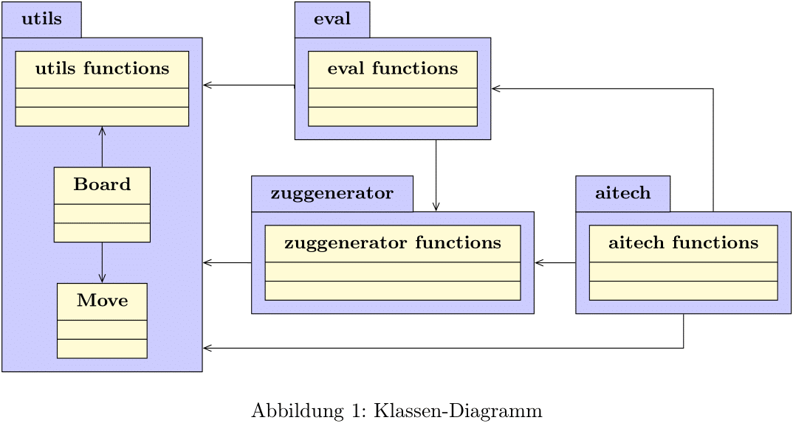

# King of the Hill chess engine
## Symbolic AI project summer semester 2023 group O

---

This Repository conatins the codebase for the symbolic AI, developed as part of 
the module "Projekt KI - symbolische Künstliche Intelligenz" at TU Berlin in 
the summer semester of 2023.

It provides a competitive chess engine for the chess variant King of the Hill. During development, we explored multiple combinations of algorithms and their versions. Various variants of the following algorithms can be found and used with this engine:
- Alpha-beta pruning
- PVS
- Monte Carlo Tree Search
- Minimax \

Furthermore it provides a pure python implementation of bitboards.
## Run

---

### best move
To get the best move of a Game, given as a fen string, run
<pre>
python path/to/ki_projekt_gruppe_o/main.py -fen your-fen-string -t 10
</pre>
Use the value behind the flag -t to specify the appointed time, to find the move. \
Replace your-fen-string, behind the flag -fen, with your games fen string. \
\
The output will be a move in the form of e.g. a5b6

### Benchmarks
To run The AI Benchmarks run the following code .
<pre>
python path/to/ki_projekt_gruppe_o/benchmark.py
</pre>

### Contests
To run The AI contests run the following code .
<pre>
python path/to/ki_projekt_gruppe_o/contests.py
</pre>
The output will be written into the contest_results.dat file.


## Object Diagram

---



## Projectstructure

---


```
ki_projekt_gruppe_o
├─── core/
│   ├─── aitech/
│   │   ├─── alpha_beta/ 
│   │   │   ├─── __init__.py
│   │   │   ├─── alpha_beta.py
│   │   │   ├─── alpha_beta_sorted.py
│   │   │   └─── alpha_beta_tt.py
│   │   ├─── pvs/
│   │   │   ├─── __init__.py
│   │   │   ├─── pvs.py
│   │   │   ├─── pvs_multi.py
│   │   │   ├─── pvs_sorted.py
│   │   │   ├─── pvs_sorted_multi.py
│   │   │   ├─── pvs_sorted_multi_qs.py
│   │   │   └─── pvs_sorted_qs.py
│   │   ├─── __init__.y
│   │   ├─── mcts.py
│   │   └─── minimax.py
│   ├─── __init__.py
│   ├─── dtm.py
│   ├─── eval.py
│   ├─── utils.py
│   └─── zuggenerator.py
├─── docs/
│   └─── croped.png
├─── benchmark.py
├─── contest_results.dat
├─── contests.py
├─── main.py
├─── README.md
└─── server-client.py
